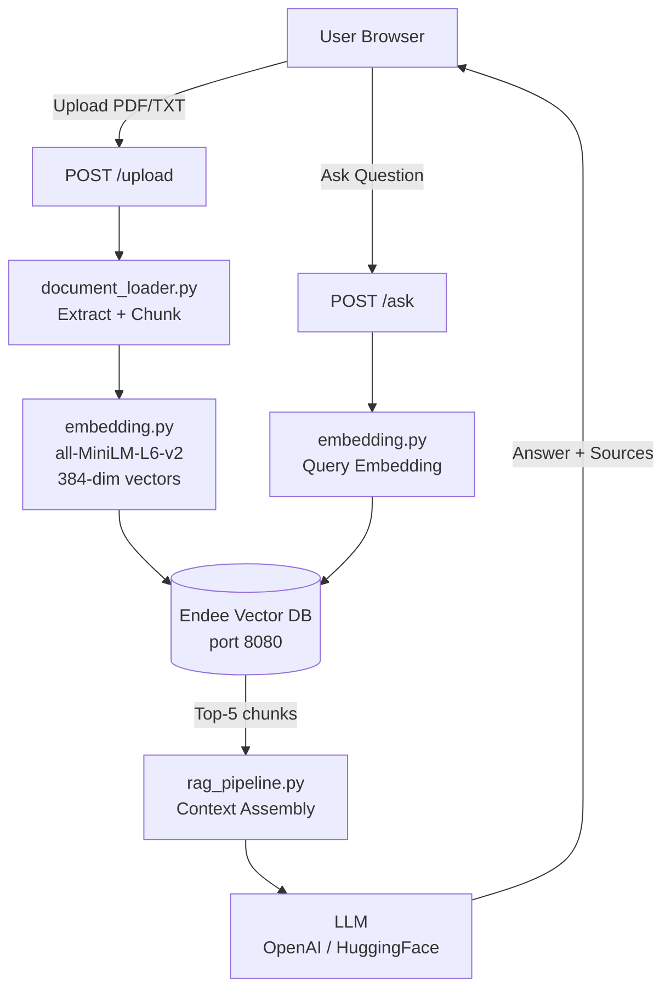

# 🧠 AI Knowledge Assistant — RAG Pipeline with Endee Vector Database

> Upload your documents. Ask anything. Get precise, grounded AI answers.

[](https://python.org)
[](https://fastapi.tiangolo.com)
[](https://endee.io)
[](https://docker.com)
[](LICENSE)

---

## 📋 Table of Contents

1. [Project Overview](#1-project-overview)
2. [Problem Statement](#2-problem-statement)
3. [System Architecture](#3-system-architecture)
4. [RAG Pipeline Explanation](#4-rag-pipeline-explanation)
5. [How Endee Vector Database is Used](#5-how-endee-vector-database-is-used)
6. [Project Structure](#6-project-structure)
7. [Installation Instructions](#7-installation-instructions)
8. [Running the Project](#8-running-the-project)
9. [API Endpoints](#9-api-endpoints)
10. [Example Queries](#10-example-queries)
11. [Future Improvements](#11-future-improvements)

---

## 1. Project Overview

The **AI Knowledge Assistant** is a production-quality Retrieval-Augmented Generation (RAG) system that allows users to:

- **Upload** PDF or TXT documents via a modern web interface
- **Index** the document content as semantic embeddings in **Endee**, a high-performance vector database delivering sub-5ms query latency
- **Ask** natural language questions about the uploaded content
- **Receive** precise AI-generated answers grounded in the actual document text, with cited sources

The system is built as an internship evaluation project to demonstrate deep understanding of:
- Vector database integration (Endee)
- Embedding models and semantic search
- RAG architecture and prompt engineering
- Production-ready API design

---

## 2. Problem Statement

Traditional keyword-based search fails when users ask questions in natural language or use different vocabulary than the source document. Large Language Models (LLMs) are powerful but tend to "hallucinate" — generating plausible-sounding but incorrect information.

**The solution**: combine **semantic search** (via vector embeddings) with **generative AI** in a Retrieval-Augmented Generation pipeline:

| Problem | Solution |
|---------|----------|
| Keyword search misses semantic meaning | Sentence-transformer embeddings capture meaning |
| LLMs hallucinate (fabricate answers) | RAG grounds answers in retrieved document chunks |
| Slow search over large document sets | Endee delivers sub-5ms vector similarity search |
| Generic AI responses | Context-injected prompts produce document-specific answers |

---

## 3. System Architecture

```
┌─────────────────────────────────────────────────────────────────┐
│                        WEB BROWSER (UI)                         │
│   ┌──────────────────┐          ┌──────────────────────────┐    │
│   │  Upload Panel    │          │    Chat / Q&A Panel      │    │
│   │  (PDF / TXT)     │          │  (ask questions)         │    │
│   └────────┬─────────┘          └─────────────┬────────────┘    │
└────────────┼────────────────────────────────┼─────────────────-─┘
             │ POST /upload                   │ POST /ask
             ▼                                ▼
┌─────────────────────────────────────────────────────────────────┐
│                    FASTAPI BACKEND (Python)                      │
│                                                                 │
│  ┌──────────────────┐   ┌────────────────┐   ┌──────────────┐  │
│  │ document_loader  │   │  embedding.py  │   │rag_pipeline  │  │
│  │ - extract text   │   │ - sentence-    │   │ - retrieve   │  │
│  │ - chunk text     │──▶│   transformers │──▶│ - build ctx  │  │
│  └──────────────────┘   └────────┬───────┘   └──────┬───────┘  │
│                                  │                  │           │
│                                  ▼                  ▼           │
│                        ┌─────────────────┐  ┌──────────────┐   │
│                        │  database.py    │  │     LLM      │   │
│                        │  (Endee SDK)    │  │ (OpenAI /    │   │
│                        └────────┬────────┘  │  HuggingFace)│   │
│                                 │           └──────────────┘   │
└─────────────────────────────────┼──────────────────────────────┘
                                  │ HTTP API
                                  ▼
┌─────────────────────────────────────────────────────────────────┐
│               ENDEE VECTOR DATABASE  (port 8080)                │
│                                                                 │
│   Index: knowledge_base                                         │
│   Dimension: 384 · Space: cosine · Precision: INT8              │
│   ┌─────────────────────────────────────────────────────────┐  │
│   │  { id, vector[384], meta: { text, source, chunk_index } }│  │
│   │  { id, vector[384], meta: { ... } }                      │  │
│   │  ...                                                      │  │
│   └─────────────────────────────────────────────────────────┘  │
└─────────────────────────────────────────────────────────────────┘
```

---

## 4. RAG Pipeline Explanation

The Retrieval-Augmented Generation pipeline has two distinct phases:

### Phase 1 — Indexing (Document Upload)

```
PDF / TXT File
      │
      ▼
 Extract Text          (PyMuPDF for PDF, UTF-8 for TXT)
      │
      ▼
 Split into Chunks     (512 chars, 64-char overlap, RecursiveCharacterTextSplitter)
      │
      ▼
 Generate Embeddings   (sentence-transformers: all-MiniLM-L6-v2 → 384-dim vectors)
      │
      ▼
 Upsert to Endee       (id, vector, metadata: {text, source, chunk_index})
```

### Phase 2 — Retrieval & Generation (Query Time)

```
User Question
      │
      ▼
 Generate Query Embedding   (same model: all-MiniLM-L6-v2)
      │
      ▼
 Vector Similarity Search   (Endee cosine_similarity, top_k=5)
      │
      ▼
 Retrieved Chunks            (most relevant document passages)
      │
      ▼
 Build LLM Prompt            (system: context, user: question)
      │
      ▼
 LLM Response                (OpenAI GPT-3.5-turbo / HuggingFace Zephyr)
      │
      ▼
 Final Answer + Sources      (returned to frontend)
```

### Why This Works

| Component | Role | Technology |
|-----------|------|------------|
| **Sentence-transformers** | Convert text → semantic vectors | `all-MiniLM-L6-v2` (384-dim) |
| **Endee** | Fast nearest-neighbour search over stored vectors | HTTP API, Python SDK |
| **Context injection** | Ground LLM in real document content | Prompt engineering |
| **LLM** | Generate fluent, natural language answer | OpenAI / HuggingFace |

---

## 5. How Endee Vector Database is Used

Endee is the **core retrieval engine** of this system. Here's the exact integration:

### 5.1 Connection & Index Creation

```python
from endee import Endee, Precision

client = Endee()
client.set_base_url("http://localhost:8080/api/v1")

client.create_index(
    name="knowledge_base",
    dimension=384,           # Matches all-MiniLM-L6-v2 output dimension
    space_type="cosine",     # Cosine similarity for normalized text embeddings
    precision=Precision.INT8 # 4× memory savings vs FP32
)
```

### 5.2 Upserting Vectors

```python
index = client.get_index("knowledge_base")

index.upsert([
    {
        "id": "unique-uuid",
        "vector": [0.023, -0.147, ...],   # 384-dim embedding
        "meta": {
            "text": "original chunk text",
            "source": "document.pdf",
            "chunk_index": 0
        }
    }
])
```

### 5.3 Semantic Search

```python
results = index.query(vector=query_embedding, top_k=5)

for item in results:
    print(f"Score: {item.similarity:.3f} | Source: {item.meta['source']}")
    print(item.meta['text'])
```

### 5.4 Why Endee?

- **Sub-5ms latency**: Responses are near-instant even with millions of vectors
- **INT8 quantisation**: Stores 4× more vectors in the same memory footprint
- **Cosine similarity**: Native support for normalized text embedding comparison
- **Rich metadata**: Store and retrieve arbitrary JSON alongside vectors
- **Docker-native**: One command to run the entire database server
- **Python SDK**: First-class client with full create/upsert/query/delete support

---

## 6. Project Structure

```
endee-ai-assistant/
│
├── backend/                        # FastAPI Python application
│   ├── main.py                     # FastAPI app, endpoints, lifespan
│   ├── document_loader.py          # PDF/TXT parsing + text chunking
│   ├── embedding.py                # Sentence-transformer embeddings
│   ├── database.py                 # Endee vector DB integration
│   ├── rag_pipeline.py             # Full RAG: retrieve + generate
│   ├── requirements.txt            # Python dependencies
│   ├── Dockerfile                  # Backend container definition
│   └── .env.example                # Environment variable template
│
├── frontend/                       # Static web UI
│   ├── index.html                  # Semantic HTML structure
│   ├── style.css                   # Dark glassmorphism design system
│   └── script.js                   # Upload, chat, source rendering
│
├── sample_docs/
│   └── example.txt                 # Test document (AI overview)
│
├── docker-compose.yml              # Endee + backend orchestration
└── README.md                       # This file
```

---

## 7. Installation Instructions

### Prerequisites

| Requirement | Version | Notes |
|-------------|---------|-------|
| Python | 3.10+ | Backend runtime |
| Docker Desktop | Latest | For Endee server |
| OpenAI API Key | — | OR use HuggingFace (free) |

### Option A: Local Development (Recommended for getting started)

**Step 1: Clone the repository**
```bash
git clone https://github.com/your-username/endee-ai-assistant.git
cd endee-ai-assistant
```

**Step 2: Start Endee vector database**
```bash
docker run \
  --ulimit nofile=100000:100000 \
  -p 8080:8080 \
  -v ./endee-data:/data \
  --name endee-server \
  --restart unless-stopped \
  endeeio/endee-server:latest
```

Verify Endee is running: open [http://localhost:8080](http://localhost:8080) in your browser.

**Step 3: Set up the Python backend**
```bash
cd backend

# Create and activate a virtual environment
python -m venv .venv
# Windows:
.venv\Scripts\activate
# macOS/Linux:
source .venv/bin/activate

# Install dependencies
pip install -r requirements.txt
```

**Step 4: Configure environment variables**
```bash
# Copy the template
cp .env.example .env

# Edit .env and add your OpenAI API key:
# OPENAI_API_KEY=sk-...
# OR set LLM_BACKEND=huggingface to use the free HuggingFace API
```

**Step 5: Start the FastAPI backend**
```bash
uvicorn main:app --host 0.0.0.0 --port 8000 --reload
```

**Step 6: Open the frontend**

Simply open `frontend/index.html` in your browser (double-click or `File → Open`).

---

### Option B: Docker Compose (Full stack)

```bash
# Add your API key to the environment
export OPENAI_API_KEY=sk-your-key-here

# Start everything
docker compose up --build

# Access:
# Frontend: open frontend/index.html in browser
# API docs: http://localhost:8000/docs
# Endee dashboard: http://localhost:8080
```

---

## 8. Running the Project

### Quick Start (after setup)

```bash
# Terminal 1: Start Endee
docker start endee-server

# Terminal 2: Start FastAPI backend
cd backend
.venv\Scripts\activate    # Windows
uvicorn main:app --reload --port 8000

# Open frontend/index.html in your browser
```

### Verify Everything is Running

| Service | URL | Expected |
|---------|-----|----------|
| FastAPI health | [http://localhost:8000](http://localhost:8000) | `{"status": "ok"}` |
| FastAPI docs | [http://localhost:8000/docs](http://localhost:8000/docs) | Swagger UI |
| Endee dashboard | [http://localhost:8080](http://localhost:8080) | Endee UI |
| Index stats | [http://localhost:8000/stats](http://localhost:8000/stats) | Index info |

### Using the Application

1. **Open** `frontend/index.html` in your browser
2. **Upload** a document using the left panel (drag-and-drop or browse)
3. **Wait** for the "✓ indexed successfully" confirmation
4. **Ask** a question in the right panel chat interface
5. **View** the AI answer with expandable source citations

---

## 9. API Endpoints

### `GET /`
Health check.

**Response:**
```json
{
  "status": "ok",
  "service": "AI Knowledge Assistant",
  "version": "1.0.0",
  "vector_db": "Endee"
}
```

---

### `POST /upload`
Upload and index a document into Endee.

**Request:** `multipart/form-data` with field `file` (`.pdf` or `.txt`)

**Response:**
```json
{
  "message": "Document 'example.txt' indexed successfully.",
  "filename": "example.txt",
  "chunks_stored": 14
}
```

**Errors:** `415` unsupported type · `422` no text extracted · `500` server error

---

### `POST /ask`
Ask a question and receive an AI-generated answer.

**Request body:**
```json
{
  "question": "What is Retrieval-Augmented Generation?",
  "top_k": 5
}
```

**Response:**
```json
{
  "question": "What is Retrieval-Augmented Generation?",
  "answer": "Retrieval-Augmented Generation (RAG) is an AI framework that...",
  "sources": [
    {
      "source": "example.txt",
      "chunk_index": 7,
      "score": 0.9312,
      "preview": "RAG is an AI framework that combines retrieval-based..."
    }
  ],
  "top_k_retrieved": 5
}
```

---

### `GET /stats`
Endee index statistics.

**Response:**
```json
{
  "endee_index": {
    "index_name": "knowledge_base",
    "dimension": 384,
    "space_type": "cosine",
    "vector_count": 42
  }
}
```

---

## 10. Example Queries

After uploading `sample_docs/example.txt`:

| Question | Expected Topic |
|----------|---------------|
| "What is Artificial Intelligence?" | AI definition, history |
| "Explain the difference between ML and Deep Learning" | ML subfields |
| "How does RAG reduce hallucination?" | RAG pipeline |
| "What are the ethical concerns around AI?" | AI Ethics section |
| "Which vector databases are available?" | Vector DB comparison |
| "What is the future of AI?" | Future of AI section |
| "Who coined the term Artificial Intelligence?" | John McCarthy |

---

## 11. Future Improvements

| Improvement | Description | Priority |
|-------------|-------------|----------|
| **Hybrid Search** | Combine dense vector search with BM25 sparse search for better recall | High |
| **Multi-tenancy** | Separate vector namespaces per user/organization | High |
| **Document management** | List, preview, and delete indexed documents | Medium |
| **Streaming responses** | Stream LLM tokens to the UI via SSE | Medium |
| **Re-ranking** | Cross-encoder re-ranking of retrieved chunks for better precision | Medium |
| **PDF preview** | Show PDF pages alongside answers | Low |
| **Chat history** | Persist and resume previous Q&A sessions | Low |
| **Multiple indexes** | One Endee index per document for isolated search | Low |
| **Authentication** | User login and per-user document access | High (production) |
| **Endee queryable encryption** | Protect sensitive document embeddings at rest | High (enterprise) |

---

## Architecture at a Glance



---

## Tech Stack Summary

| Layer | Technology | Purpose |
|-------|------------|---------|
| **Frontend** | HTML + Vanilla JS + CSS | Web UI, zero dependencies |
| **Backend** | Python 3.11 + FastAPI | REST API server |
| **Vector DB** | Endee | Semantic similarity search |
| **Embeddings** | sentence-transformers | Text → vector conversion |
| **LLM** | OpenAI GPT-3.5 / HuggingFace | Answer generation |
| **PDF Parsing** | PyMuPDF (fitz) | Extract text from PDFs |
| **Chunking** | LangChain Text Splitters | Smart document segmentation |
| **Containers** | Docker + Docker Compose | One-command deployment |

---

*Built for the Endee AI Infrastructure Internship Assessment · March 2026*
